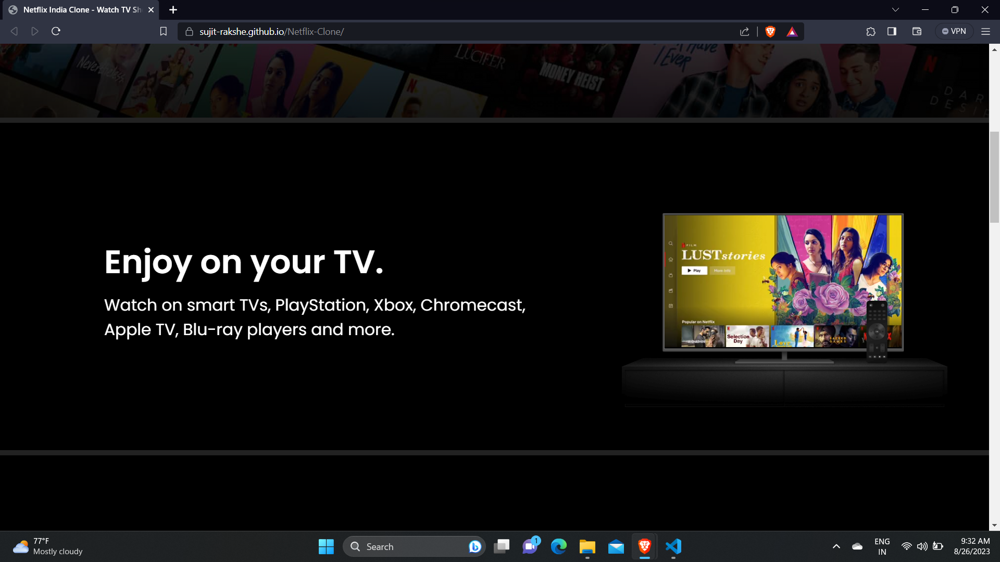

# Netflix Clone Project for WebDev Internship

A Netflix clone built as a part of my web development internship at Bharat Intern. 

**Tech Stack:** HTML, CSS, JavaScript

🚀 **Check out the live demo:** [Live Demo Link](https://sujit-rakshe.github.io/Clone)

📝 This project is developed for learning purposes and to demonstrate my skills in frontend web development.

🔧 Contributions and feedback are welcome!

## Screenshots

## License

This project is licensed under the MIT License - see the [LICENSE](LICENSE) file for details.
